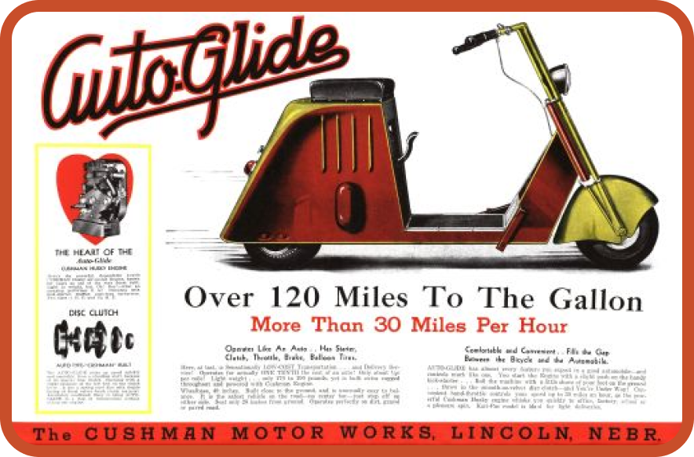
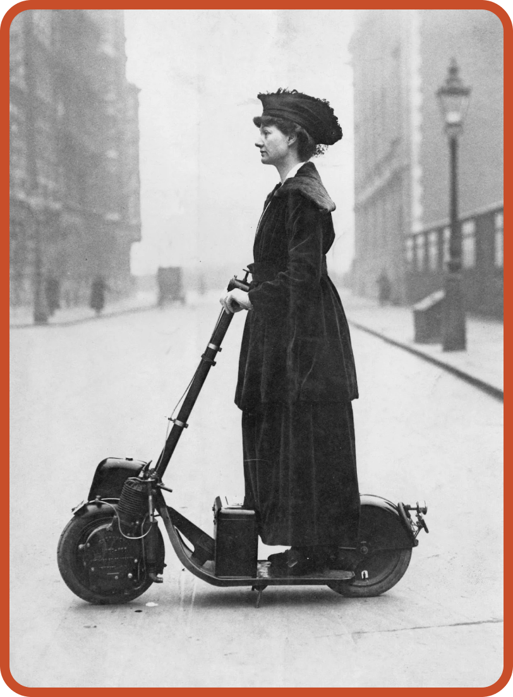
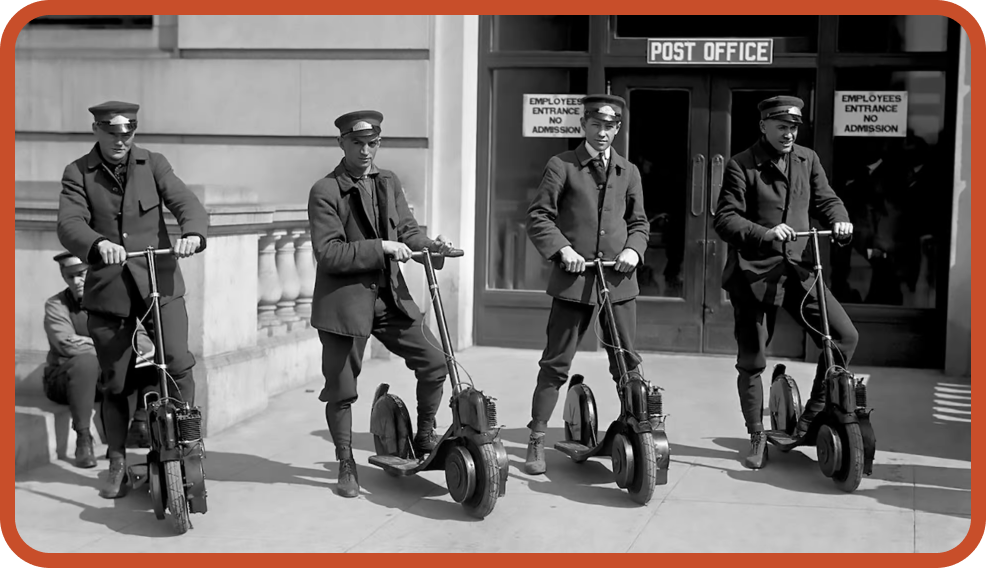
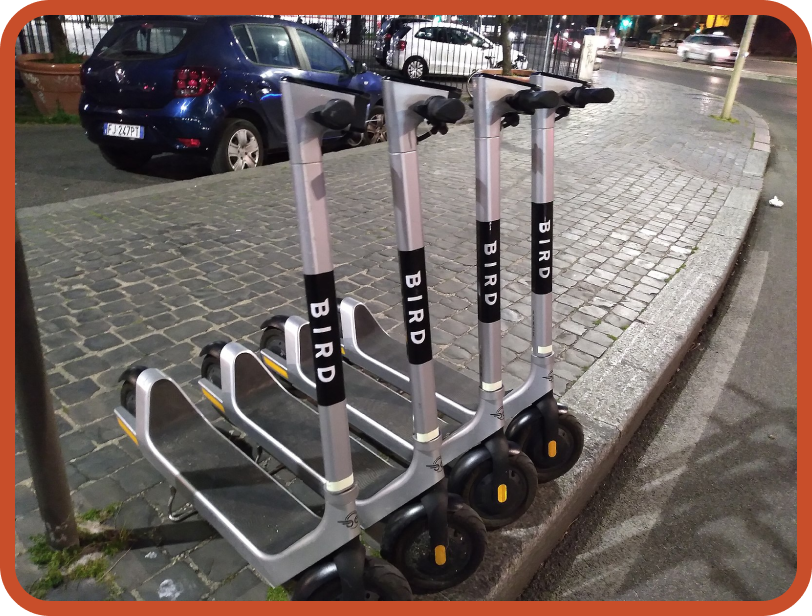
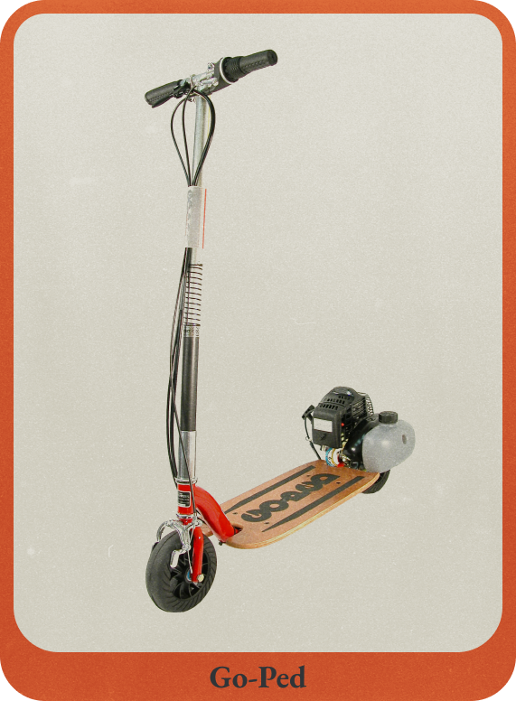
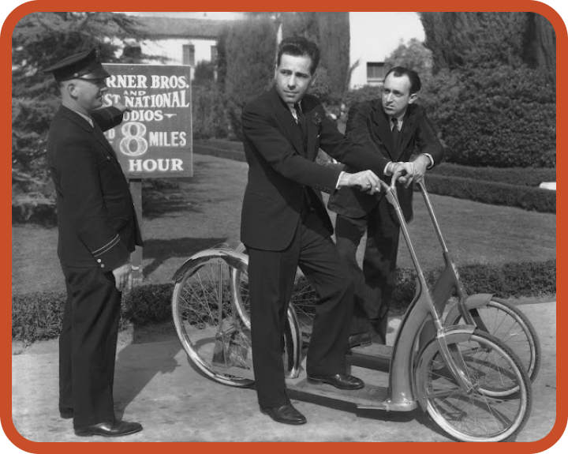

# 예나 지금이나 같은 킥보드 문제

소재: 전동 킥보드의 역사
발행일: 2024년 6월 10일
인사이트: No

<aside>
💡 **킥보드**
긴 손잡이가 있고, 바닥에 2~4개의 작은 바퀴가 달린 탈것. 두 손으로 손잡이를 잡고 한 발로 바닥을 밀면서 탄다.
****- 국립국어원 표준국어대사전

</aside>

***Comment.***

---

시작하기에 앞서 자료 조사를 하면서 가장 애를 먹었던 부분은 킥보드와 스쿠터의 차이가 무엇인지에 대한 것이었습니다. 우리나라에서는 안장 여부로 킥보드와 스쿠터를 구분합니다. 하지만 영어로는 안장 여부와 상관없이 모두 스쿠터입니다. 킥보드는 ‘수영 발차기를 연습할 때 사용하는 물에 뜨는 직사각형 판’을 의미하죠. 

그러면 왜 우리나라에서는 스쿠터를 킥보드라고 부르는 걸까요? 1999년 K2 Sports에서 출시한 스쿠터 브랜드 킥보드*Kickboard* 에서 유래된 것으로 추정됩니다. 이 제품은 2000년 4월 한국에 처음 들어와 대학가를 시작으로 인기를 끌었고, 킥보드라는 브랜드 이름이 일반 명사가 된 것이죠.

이 글에서는 보드형 바닥이 있고, 두 발이 보드 위에 얹는 형태의 탈 것을 스쿠터라고 정의하고 조사했습니다. 

**- 목차 -** 

### *Fig.1* 100년 전 킥보드

***Figure.1*** 1916년 오토페드를 타고 있는 영국의 참정권 운동가인 플로렌스 노먼 부인

최초의 전동 스쿠터는 뉴욕의 롱아일랜드 시티 오토페디드 컴퍼니*Autoped Company of Long Island City* 에서 1915년에 출시했습니다. 앞바퀴를 동력으로 하는 155cc 4기통 가솔린 엔진을 탑재해 시속 57km까지 달릴 수 있었죠. 게다가 보관이 용이하도록 핸들 바가 접혔는데요. 무게가 110kg에 육박해 휴대용으로 쓰였는지는 미지수입니다.

오토페드의 가격는 100달러로 당시 미국인들 평균 연봉이 687달러인 것을 감안하면 2~3달 치 월급에 해당했지만 그래도 자동차보다는 저렴했기 때문에 “가격이 매우 저렴해서 거의 모든 사람이 구입할 수 있다고”고 광고했죠.

***Figure.2*** 미국 우정국에서 오토페드를 사용하는 모습

오토페드는 미국 우정국과 경찰청과 계약을 맺기도 했고, 캘리포니아 해변에서는 관광용 대여 사업을 하기도 했죠. 오토페드는 저렴(?)하고 쉽게 탈 수 있었기 때문에 불량 청소년들과 갱단들에게도 퍼졌습니다. 그리고 브루클린, 퀸스, 맨해튼에서 이들의 난폭 운전이 사회적으로 문제가 되었죠. 이런저런 이유에서 판매가 부진했고, 1921년 미국 생산이 중단되었습니다. 

### *Fig.1* 대공항 고연비의 스쿠터의 등장

***Figure.3*** 오토글라이드 광고 ⓒAACA Library

오토페드의 몰락 이후 스쿠터가 사라지나 싶었는데, 1929년 미국에서 대공항 시기에 되살아납니다. 당시 가장 유명했던 스쿠터 모델은 오토글라이드*auto.glide* 였습니다. 엔진을 제조하던 쿠시맨*Cushman* 이라는 회사에서 대공항으로 엔진이 팔리지 않자 자사 엔진을 탑재한 값싼 스쿠터를 제작한 것이었죠. 의자와 전조등을 추가해 우리나라에서 의미하는 스쿠터의 모습을 보입니다. 오토글라이드는 저렴하고 연비가 좋아 인기를 끕니다. 쿠시맨 스쿠터는 제2차 세계대전 당시 미군에서 널리 사용되었고, 전쟁 전후에도 자동차 대안으로 사용되었죠.

***Figure.4*** 1938년 험프리 보가트와 앨런 젠킨스가 워너 브라더스의 경비원에게 스쿠터를 타고 과속을 하다 제지당하는 모습 ⒸGetty Images, via Mashable

또한 스쿠터는 할리우드의 넓은 스튜디오 부지를 돌아다니는 이동 수단으로 쓰였는데요. 험프리 보가트*Humphrey Bogart* 와 같은 스타들이 스쿠터를 타고 있는 모습이 사진으로 찍히며 더욱 인기를 얻게 되었죠. 

그러나 1930년대 들어 미국의 교통법규가 강화되고 청소년들의 운전에 대한 규제 수위도 높아지면서, 오토글라이드는 판매에 직격탄을 맞게 되었습니다.

### *Fig.1* 스쿠터의 역사

***Figure.5*** 로마의 휴일에서 나오는 베스파

2차 세계대전 당시 항공기 부품을 만들던 이탈리아의 피아지오*Piaggio*는 전쟁이 끝난 후 연합군에 의한 제재 및 항공기 제작 수요가 없어 어려움을 겪었는데요. 피아지오는 1946년 항공기 부품을 만들던 기술을 응용해 스쿠터 베스파*Vespa* 를 제작합니다.

베스파는 당시 패전 이후 열악한 이탈리아의 경제 사정과 도로 상황에 맞아떨어지며 이탈리아에서 폭발적인 인기를 얻게 됩니다. 게다가 영화 <로마의 휴일>에서 오드리 햅번과 그레고리 펙이 베스파를 타는 장면이 나오며 세계적으로도 인지도를 얻게 되었죠. 

### *Fig.1* 전기 킥보드의 등장

***Figure.5*** 1985년에 등장한 고페드

앉아 타는 스쿠터가 발전하는 사이 두 발로 서서 타는 스쿠터는 암흑기를 맞이했는데요. 1985년 스티브 패트몬트*Steve Patmont* 가 고-페드*Go-Ped*  특허를 취득하면서 다시 두 발로 서서 타는 스쿠터가 주목받기 시작하죠. 고-페드는 처음에는 가스 구동식 스쿠터였지만, 2001년 리튬이온 배터리로 작동하는 전기 스쿠터를 출시합니다. 이 2001년 모델인 후버보드*Hoverboard* 에는 바퀴에 서스펜션을 갖추면서 승차감이 훨씬 좋아졌죠. 

### *Fig.1* 전동킥보드 공유서비스

***Figure.6*** 2017년 시작한 전동 킥보드 공유 서비스, 버드

오늘날 전동 킥보드의 인기는 누가 뭐래도 전동 킥보드 공유 서비스가 등장하면서부터입니다. 공유 서비스가 등장하기 이전 전동 킥보드는 주로 레저용으로 사용되다가 공유형 전동킥보드 서비스가 등장하면서 이동 수단으로 사용되기 시작합니다.

스쿠터 대여 서비스는 2012년 캘리포니아에서 시작한 스쿠터 네트웍스*Scooter Networks* 가 최초입니다. 두 발로 서서 타는 스쿠터 공유서비스의 최초는 2017년 역시 캘리포니아에서 서비스를 시작한 버드*Bird* 입니다. 참고로 스쿠터 네트웍스는 2018년에 킥보드와 전기 자전거로 확장했고 2019년 버드에 합병되었고, 버드는 2023년 12월 파산신청을 했죠. 

우리나라에서는 2018년 ‘고고씽’을 필두로 ‘씽씽’과 ‘킥고잉’ 등의 전동 킥보드 공유 서비스 업체들이 생기면서 전동 킥보드가 대중화됩니다. 

하지만 전동 킥보드에 대한 인식은 좋지 않은데요. 사용자들의 무단 주차와 난폭운전으로 인한 사고가 끊이지 않기 때문이었습니다. 국내에서는 2018년 최초로 전동킥보드로 인한 보행자 사망 사고가 발생했고, 2021년 전동 킥보드 관련 법이 개정되었죠. 파리에서는 2023년 9월부터 사용을 금지했습니다. 

### *Fig.1* 세그웨이

***Figure.7*** 2001년 등장한 세그웨이

가장 미래적인 형태의 스쿠터가 무엇일까 하면 단연 세그웨이입니다. 세그웨이는 여러 의료용 장치를 발명한 것으로 유명한 딘 카멘*Dean Kamen* 이 2001년 12월에 공개한 1인용 스쿠터입니다. 참고로 그가 개발한 의료용 기기로는 휴대용 인슐린 펌프, 서류 가방 크기의 신장투석기, 계단을 오르내릴 수 있는 휠체어 등이 있죠. 

세그웨이는 자이로 센서로 구동되어 자동으로 중심을 잡고 몸의 움직임만으로 방향 전환이 가능한 스쿠터로 최대 20km의 속도를 낼 수 있습니다. 하지만 가격이 거의 천만 원대를 호가하였고, 안정성 문제, 타 이동 수단에 비해 장점이 명확하지 않은 점 등으로 인해 인기가 사그라듭니다. 2015년에는 중국의 나인봇이 세그웨이를 인수하고, 2020년에는 생산이 중단되죠.

***Reference.***

---

- Mike Hanlon. (2016). (The original) 100 year-old motorscooter up for sale. NEW ATLAS. URL : https://newatlas.com/original-scooter-eveready-autoped/45714/
- TAUR. (2020). **The History of Electric Scooters. Lotus Fruit. [URL:](https://medium.com/lotus-fruit/the-history-of-the-first-electric-scooter-5c00e0053468#id_token=eyJhbGciOiJSUzI1NiIsImtpZCI6IjY3NGRiYmE4ZmFlZTY5YWNhZTFiYzFiZTE5MDQ1MzY3OGY0NzI4MDMiLCJ0eXAiOiJKV1QifQ.eyJpc3MiOiJodHRwczovL2FjY291bnRzLmdvb2dsZS5jb20iLCJhenAiOiIyMTYyOTYwMzU4MzQtazFrNnFlMDYwczJ0cDJhMmphbTRsamRjbXMwMHN0dGcuYXBwcy5nb29nbGV1c2VyY29udGVudC5jb20iLCJhdWQiOiIyMTYyOTYwMzU4MzQtazFrNnFlMDYwczJ0cDJhMmphbTRsamRjbXMwMHN0dGcuYXBwcy5nb29nbGV1c2VyY29udGVudC5jb20iLCJzdWIiOiIxMDE0MjE5MDExMDI3MzgxMDMxMTciLCJlbWFpbCI6ImtzZDIxMEBnbWFpbC5jb20iLCJlbWFpbF92ZXJpZmllZCI6dHJ1ZSwibmJmIjoxNzE3NjQzODgyLCJuYW1lIjoic3VkYW0ga3UgKERhbSBLKSIsInBpY3R1cmUiOiJodHRwczovL2xoMy5nb29nbGV1c2VyY29udGVudC5jb20vYS9BQ2c4b2NKTHYwRHpkQzZtc1k4Q2ctQ0ZOUGJYcEkzRzhxQXY2MFVEQzQ4Vm16NFNGSjhmUEE9czk2LWMiLCJnaXZlbl9uYW1lIjoic3VkYW0iLCJmYW1pbHlfbmFtZSI6Imt1IiwiaWF0IjoxNzE3NjQ0MTgyLCJleHAiOjE3MTc2NDc3ODIsImp0aSI6ImQzODk5NzFmN2ExM2RlZGNiZmYyNTQyNmUwMjA1NWM4Mjk0MTE5N2IifQ.jLUBitT2qBBPbqTxS1_nXpsPpyB6bBzhzLqll1yFDt2OVeL4ThPByDX-VvFIEgOZla0D36fES6lIgG3MyMvpy_zVmqOocKVPAt6x8cyIdzRnnV61Uv9A0phZDqdDbv4b6uu8AVp-4vpwfmKI3y0vEt6xzmjMWZf-jSmsq83brbYM2olUdDr_YbwXcI-WGkpT8aHZeZplQcZwHpVNzyxXQ90RKlf0Ow_JL1cSVTn1BwuX3CJ7lI0ciqPTND_wUMFqKdgeyupUocCEhl3Ows2x_GF3c6AQVCDXhnlxo40F93UfFAjKeNK42WshQH898tmoxoZOlmIzhxsCTGOJJn4BBw)**
- Unkown. (2021). The amazing history of motorised scooters. ANADUE. URL : https://www.anadue.com/post/the-amazing-history-of-motorised-scooters
- Vespa Hompage. URL : https://www.vespa.com/us_EN/timeline/
- 민병권. (2019). [토요워치]전동킥보드 원조는 1915년 美 '오토패드'...고가에 의자 없어 흥행 실패. 서울경제. URL : https://www.sedaily.com/NewsView/1VPHCS6LED
- 박혜민. (2020). **[번역기도 모르는 진짜 영어] scooter. 중앙일보. URL :**  https://www.joongang.co.kr/article/23875686#home